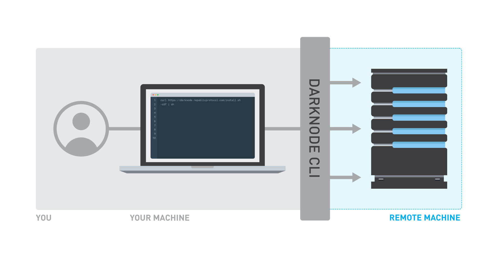

# Darknode CLI

The Darknode CLI is a command-line interface for managing Darknodes on Republic Protocol.

The CLI is installed in your local workspace and used to deploy and operate darknodes. 


Currently it only support macOS and Linux. 

## Getting Started on AWS

To jump straight into running your first Darknode on AWS, checkout our [Getting Started on AWS](./docs/getting-started-on-aws.md) tutorial.

## Getting Started on Digital Ocean
 
Checkout the instructions for [Creating a Personal Access Token](https://github.com/republicprotocol/darknode-cli#digital-ocean) on Digital Ocean.

## Installation

To download and install the Darknode CLI, open a terminal and run:

```sh
curl https://darknode.republicprotocol.com/install.sh -sSf | sh
```

This will download the required binaries and templates and install them to the `$HOME/.darknode` directory. Open a new terminal to begin using the Darknode CLI.

## Updating Darknode CLI

To update your Darknode CLI, open a terminal and run:

```sh
curl https://darknode.republicprotocol.com/update.sh -sSf | sh
```

This will update your Darknode CLI to the latest version without affecting any of your deployed node. 

## Usage

_Here there be dragons!_

These guidelines are for advanced users. If you just want to see what deploying a Testnet Darknode is like, checkout our [Getting Started on AWS](./docs/getting-started-on-aws.md) tutorial.

### Deploy a Darknode

#### AWS

To deploy a Darknode on AWS, open a terminal and run:

```sh
darknode up --network testnet --name my-first-darknode --aws --aws-access-key YOUR-AWS-ACCESS-KEY --aws-secret-key YOUR-AWS-SECRET-KEY
``` 

The Darknode CLI will automatically use the credentials available at `$HOME/.aws/credentials` if you do not explicitly set the `--access-key` and `--secret-key` arguments.

You can also specify the region and instance type you want to use for the Darknode:

```sh
darknode up --network testnet --name my-first-darknode --aws --aws-access-key YOUR-AWS-ACCESS-KEY --aws-secret-key YOUR-AWS-SECRET-KEY --aws-region eu-west-1 --aws-instance t2.small
``` 

You can find all available regions and instance types at [AWS](https://docs.aws.amazon.com/AmazonRDS/latest/UserGuide/Concepts.RegionsAndAvailabilityZones.html).

You can also associate the darknode to an elastic IP by providing the `EIP-ALLOCATION-ID` of the elastic IP. 
Make sure you give the same region of the elastic IP to the darknode. 


```sh
darknode up --network testnet --name my-first-darknode --aws --aws-access-key YOUR-AWS-ACCESS-KEY --aws-secret-key YOUR-AWS-SECRET-KEY --aws-region SAME-REGION-AS-EIP --aws-elastic-ip EIP-ALLOCATION-ID
``` 

#### Digital Ocean

Follow the steps in the [tutorial](https://www.digitalocean.com/docs/api/create-personal-access-token/) to create a API token. 
To deploy a Darknode on Digital Ocean, open a terminal and run:

```sh
darknode up --network testnet --name my-first-darknode --do --do-token YOUR-API-TOKEN
``` 

You can also specify the region and droplet size you want to use for the Darknode:

```sh
darknode up --network testnet --name my-first-darknode --do --do-token YOUR-API-TOKEN --do-region nyc1 --do-droplet 8gb
``` 

Be aware some region and droplet size are not available to all users.

You can find all available regions and droplet size slug by using the digital ocean [API](https://developers.digitalocean.com/documentation/v2/#regions).

### Destroy a Darknode

_**WARNING: Before destroying a Darknode make sure you have de-registered it, and withdrawn all fees earned!**_

Destroying a Darknode will turn it off and tear down all resources allocated by the cloud provider. To destroy a Darknode, open a terminal and run:

```sh
darknode destroy my-first-darknode
``` 

To avoid the command-line prompt reminding you to deregister your Darknode, use the `--force` argument: 

```sh
darknode destroy my-first-darknode --force
```

We do not recommend using the `--force` argument unless you are developing custom tools that manage your Darknodes automatically.


### List all Darknodes

The Darknode CLI supports deploying multiple Darknodes. To list all available Darknodes, open a terminal and run:

```sh
darknode list
```

### Stop Darknode

To turn off your darknode, open a terminal and run: 

```sh
darknode stop my-first-darknode

``` 

If it is already off, `stop` will do nothing.

### Start Darknode

To turn on your darknode, open a terminal and run: 

```sh
darknode start my-first-darknode
``` 

If it is already on, `start` will do nothing.

### SSH into Darknode

To access your Darknode using SSH, open a terminal and run:

```sh
darknode ssh my-first-darknode
``` 

### Update a Darknode

To update your Darknode to the latest stable version, open a terminal and run:

```sh
darknode update YOUR-DARKNODE-NAME
``` 

To update the configuration of your darknode, first edit the local version of config, by running:

```sh
nano $HOME/.darknode/darknodes/YOUR-DARKNODE-NAME/config.json
``` 

and now run:

```sh
darknode update my-first-darknode --config
``` 

### Refund your darknode

To refund the bonds of your darknode after deregistering, open a terminal and run:

```sh
darknode refund YOUR-DARKNODE-NAME
``` 

If you also have some ETH left in the darknode address or REN accidentally been sent
to that address, you can get them back by adding the `--all` tag:

```sh
darknode refund YOUR-DARKNODE-NAME --all
``` 
