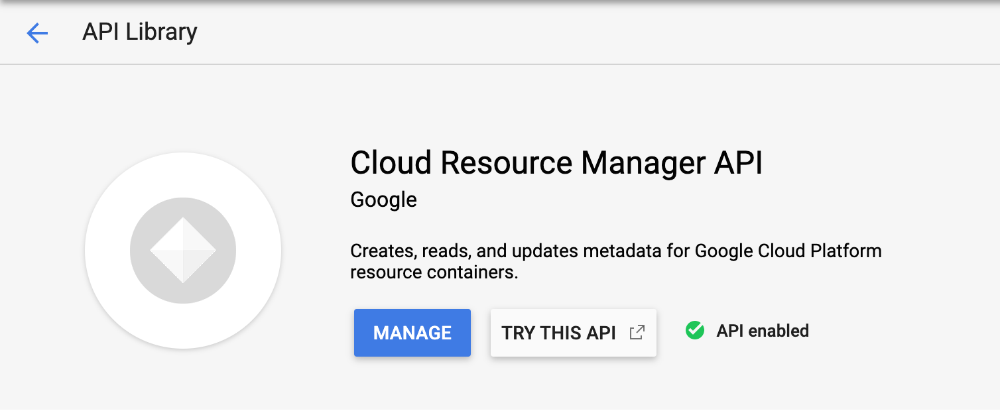
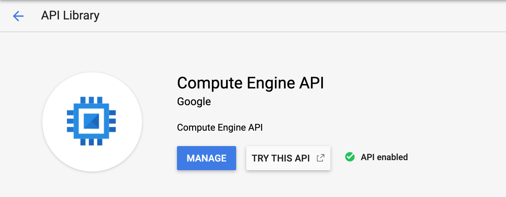
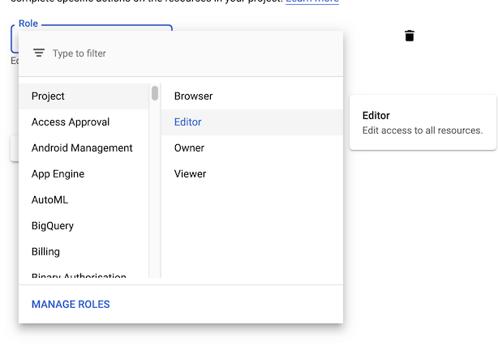
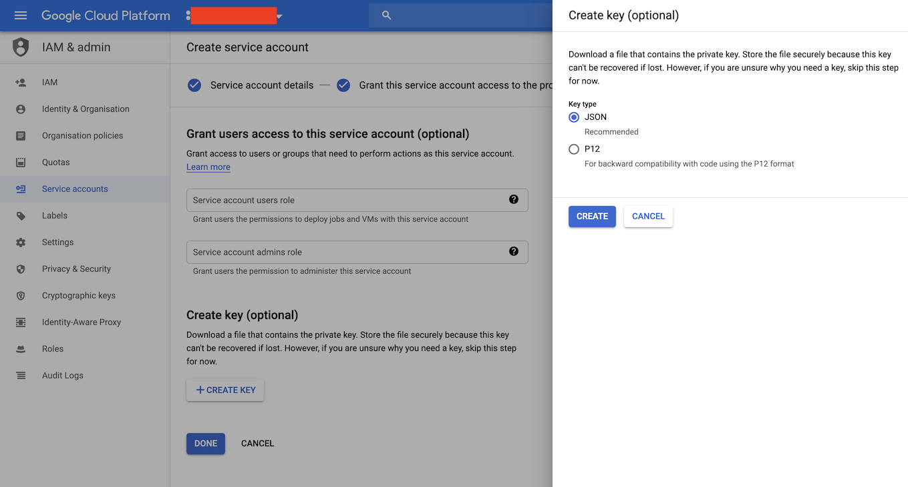

# Getting Started on Google Cloud Platform

Before installing and using the Darknode CLI, make sure that you have [created a Google Account](https://accounts.google.com/SignUp) and configured billing for [Google Cloud Platform](https://cloud.google.com/billing/docs/how-to/manage-billing-account), and [created a Project](https://cloud.google.com/resource-manager/docs/creating-managing-projects).

# Enabling the API

You need to enable both the [Cloud Resource Manager API](https://console.developers.google.com/apis/library/cloudresourcemanager.googleapis.com) and 
the [Compute Engine API](https://console.developers.google.com/apis/library/compute.googleapis.com). Make sure your project is selected and you're using the correct google account. 

You should be able to something like below if you successfully enable the APIs. 




# Create a Service Account

Create a [Service Account](https://cloud.google.com/iam/docs/creating-managing-service-accounts) in your project. During creating, grant it the role of Project \> Editor, and download a key in JSON format. You will have to pass this JSON Key file path to the Darknode-CLI

### Creating a Service account

### Assigning a role



### Generating a JSON Key



## Installing the Darknode CLI

To install the Darknode CLI, open a terminal and run:

```sh
curl https://www.github.com/renproject/darknode-cli/releases/latest/download/install.sh -sSfL | sh
```

Once this has finished, close the terminal and open a new one.

## Deploying a Darknode

Now, you can deploy a Darknode. Think of a catchy name, and run:

```sh
darknode up --name my-first-darknode --gcp --gcp-credentials PATH_TO_YOUR_DOWNLOADED_JSON_FILE
```
Once this has finished, it will give you a link that you can use to register your Darknode and send it ETH.

Congratulations! You have deployed your first Darknode. You can deploy as many as you like, distinguishing between them by their names. If you forget what you called them, you can list all available Darknodes by running:

```sh
darknode list
```

### Choosing a compute zone

You can specify in which [Compute Engine Zone](https://cloud.google.com/compute/docs/regions-zones/) you deploy your node with the --gcp-zone flag. If omitted, a random zone is selected.

```sh
darknode up --name my-first-darknode --gcp --gcp-credentials PATH_TO_YOUR_DOWNLOADED_JSON_FILE --gcp-zone europe-west1-b
```

### Choosing a machine type

You can specify with which [Machine Type](https://cloud.google.com/compute/docs/machine-types) you deploy your node with the --gcp-machine-type flag. If omitted, n1-standard-1 is selected.

```sh
darknode up --name my-first-darknode --gcp --gcp-credentials PATH_TO_YOUR_DOWNLOADED_JSON_FILE --gcp-machine-type f1-micro
```