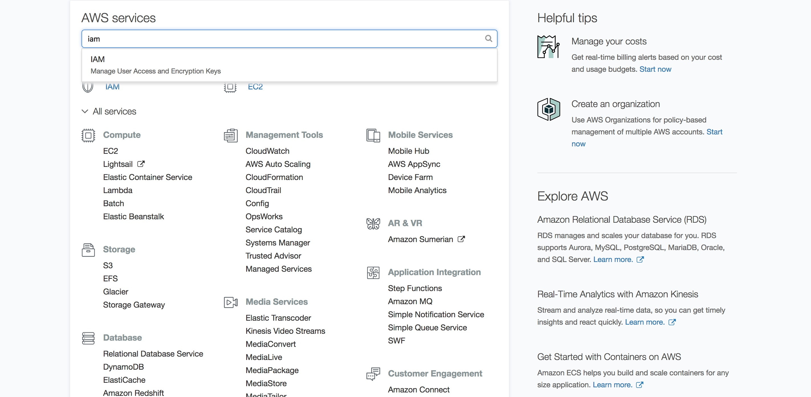
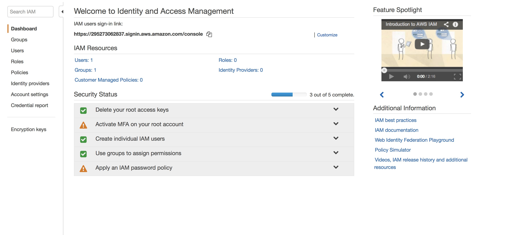
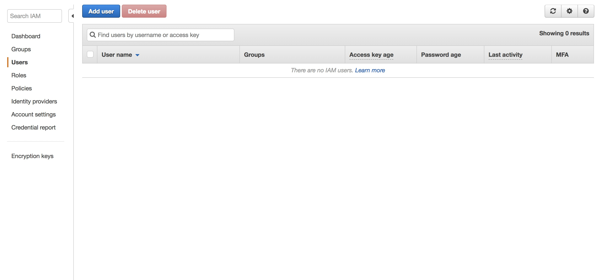
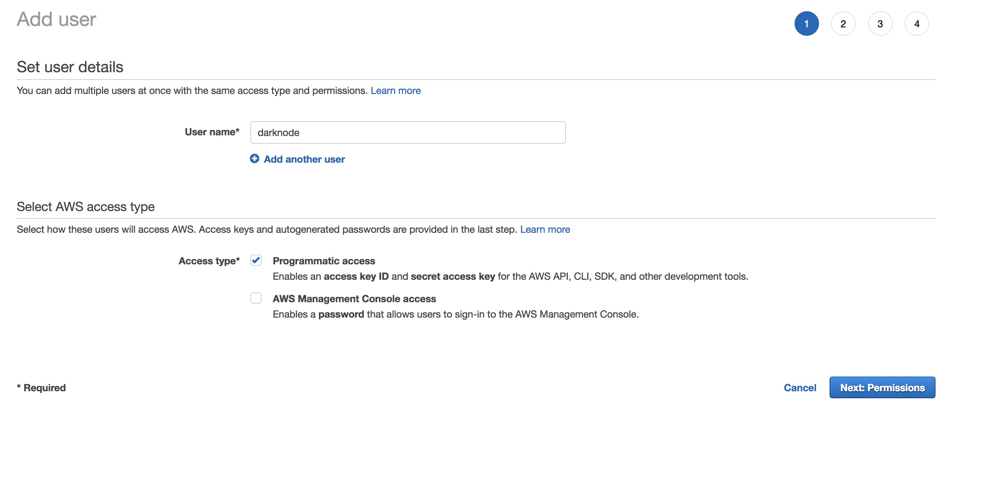
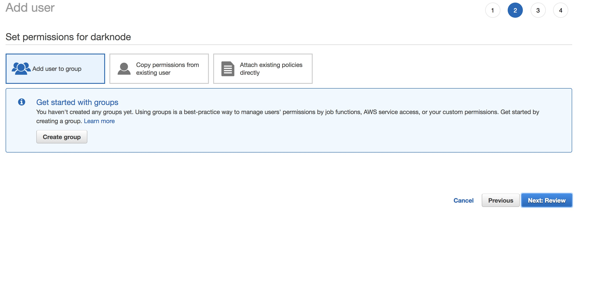
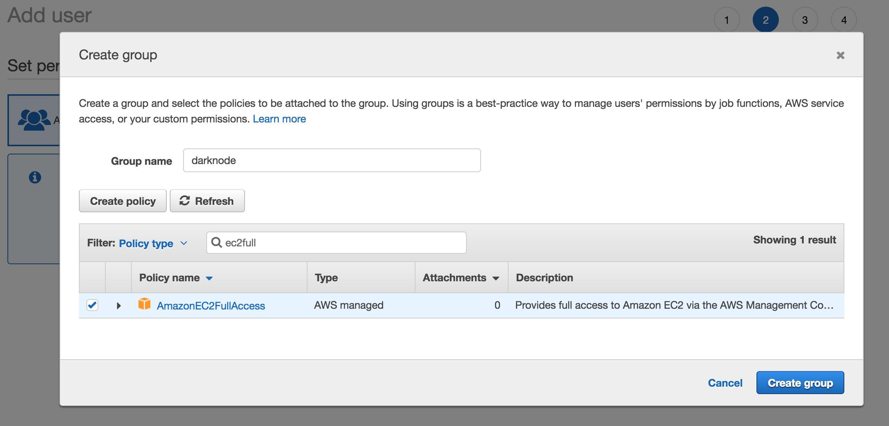
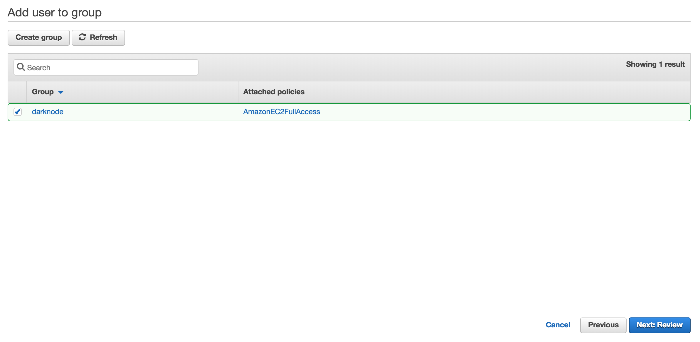
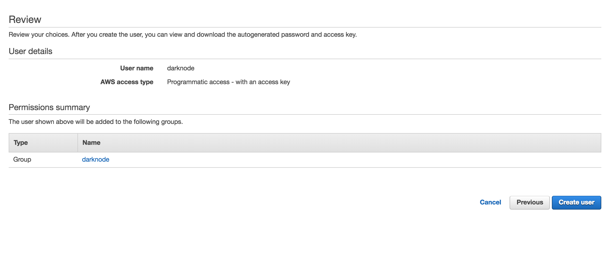
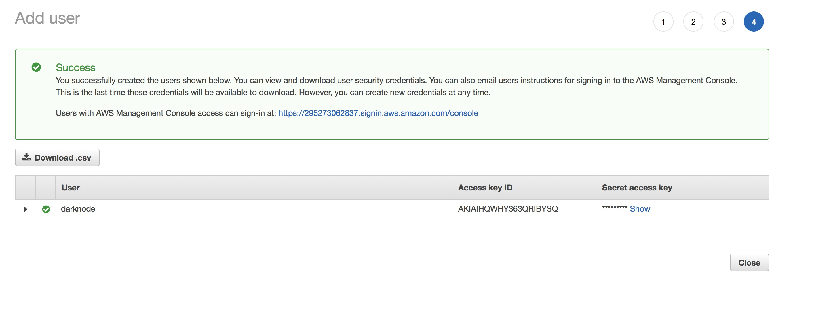

# Getting Started on AWS

Before installing and using the Darknode CLI, make sure that you have created an AWS account.

[Create an AWS account](https://aws.amazon.com)

## Creating a Darknode User Accounts

It is not recommended to use your default account for managing your Darknodes. Instead, we recommend creating a custom user.

Make sure you have created an account, and then go to the [AWS Console](https://console.aws.amazon.com/). Enter _IAM_ into the search bar. You should see something like this



Press enter, or click the _IAM_ option in the search results. You should see something like this



Click _Users_. You should see something like this



Click _Add user_. You should see something like this



Name the user _darknode_ and make sure to check _Programmatic Access_. Then, click _Next: Permissions_. You should see something like this



Click _Create group_. You should see something like this



Name the group _darknode_ and make sure to check _AmazonEC2FullAccess_. Then, click _Create group_. You should see something like this



Click _Next: Review_. You should see something like this



Click _Create user_. You should see something like this



Download the CSV file containing your _access key ID_, and your _secret access key_. Make sure you keep these values secure, anyone with access to them will be able to control your Darknode.

## Installing the Darknode CLI

To install the Darknode CLI, open a terminal and run:

```sh
curl https://darknode.republicprotocol.com/install.sh -sSf | sh
```

Once this has finished, close the terminal and open a new one.

## Deploying a Darknode

> If this step fails, you might have to wait 24 hous before being able to use your AWS account.

Now, you can deploy a Darknode. Think of a catchy name, and run:

```sh
darknode up --network testnet --name my-first-darknode --aws --aws-access-key YOUR-AWS-ACCESS-KEY --aws-secret-key YOUR-AWS-SECRET-KEY
```

Once this has finished, it will give you a link that you can use to register your Darknode and send it ETH.

Congratulations! You have deployed your first Darknode. You can deploy as many as you like, distinguishing between them by their names. If you forget what you called them, you can list all available Darknodes by running:

```sh
darknode list
```

## Keeping up to date

It is important to keep your Darknode updated to the latest verison. This will ensure that you are compatible with the rest of the network, and that you have the latest security updates and bug fixes.

To update a Darknode, run:

```sh
darknode update --name my-first-darknode
```
